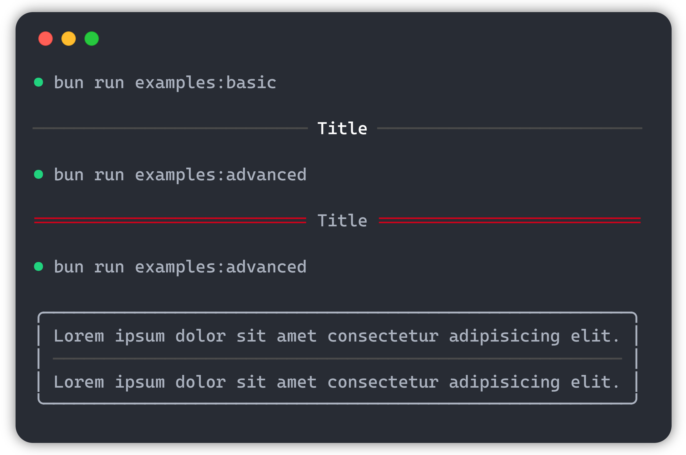

<!-- # ${\color{gray}\tiny\textrm{──────}}$  ink-divider  ${\color{gray}\tiny\textrm{──────}}$ -->
# ink-divider

[](https://www.npmjs.com/package/ink-divider) [](https://www.npmjs.com/package/ink-divider)


👩🏼‍🎨 Divider component for [Ink](https://github.com/vadimdemedes/ink).

## 📥 Install

```bash
npm i ink-divider
```

## 🚀 Usage

Here is the basic usage:

```jsx
import { render } from 'ink'
import Divider from 'ink-divider'

render(<Divider title='Title' />)

// ─────────── Title ───────────
```

The `<Divider>` component can also automatically adjust to the width of the container!
We advise you to view this example - [`examples/auto-grow.tsx`](https://github.com/JureSotosek/ink-divider/blob/master/examples/auto-grow.tsx), more examples in the [`examples`](https://github.com/JureSotosek/ink-divider/tree/master/examples) folder

<!-- markdownlint-disable-next-line-->


## 🤝 Contributing

Thank you for your interest in helping this project 😎, detailed instructions on contributing are at [CONTRIBUTING.md](CONTRIBUTING.md)

## 📝 License

MIT © [Jure Sotosek](https://github.com/JureSotosek)
