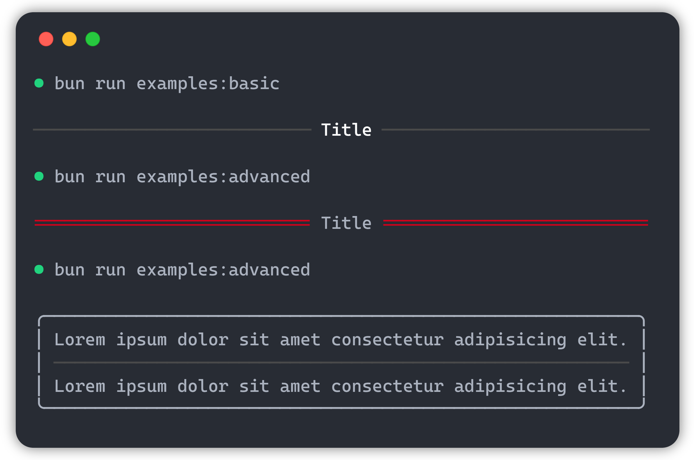

# ink-divider

[](https://circleci.com/gh/JureSotosek/ink-divider)

👩🏼‍🎨 Divider component for [Ink](https://github.com/vadimdemedes/ink).

## Install

```
$ npm install ink-divider
```

## Usage

```js
import React from 'react';
import {render} from 'ink';
import Divider from 'ink-divider';

render(<Divider title={'Title'} />);
```



## Props

### title

Type: `string`<br>
Default: `""`

Title shown in the middle of the divider.

### width

Type: `number`<br>
Default: `50`

Width of the divider.

### padding

Type: `number`<br>
Default: `1`

Padding at the start and the end of the divider.

### titlePadding

Type: `number`<br>
Default: `1`

Padding besides the title in the middle.

### titleColor

Type: `string`<br>
Default: `"white"`

Color of the title.

### dividerChar

Type: `string`<br>
Default: `"-"`

Char used as a divider.

### dividerColor

Type: `string`<br>
Default: `"gray"`

Color of the divider chars.

## License

MIT © [Jure Sotosek](https://github.com/JureSotosek)
